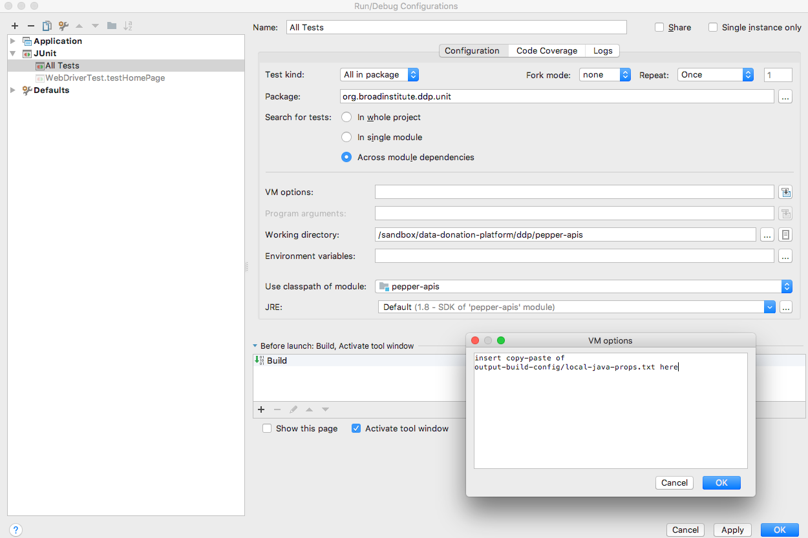
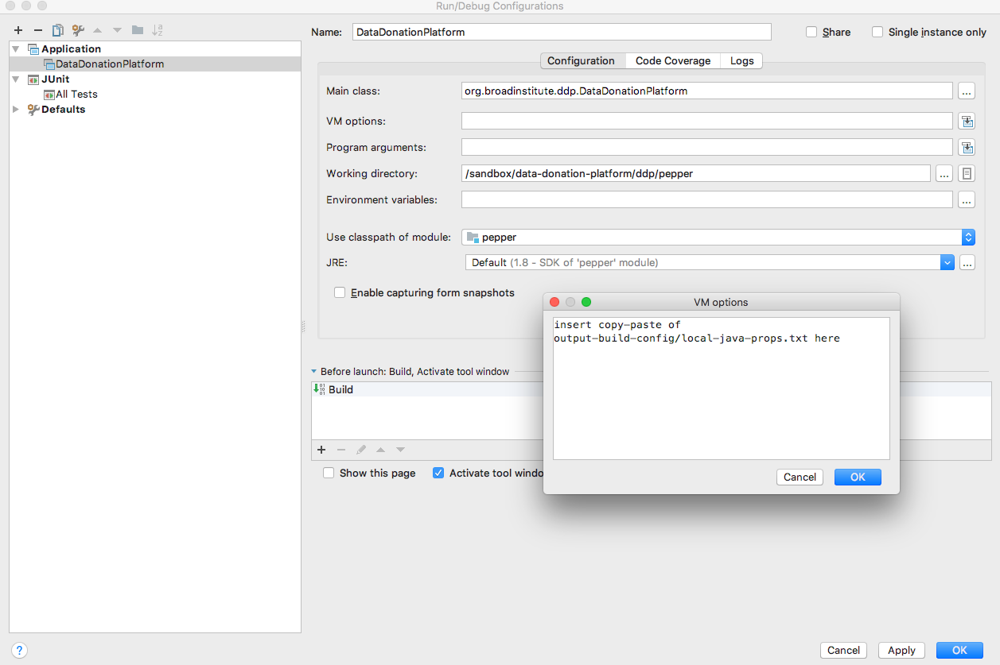
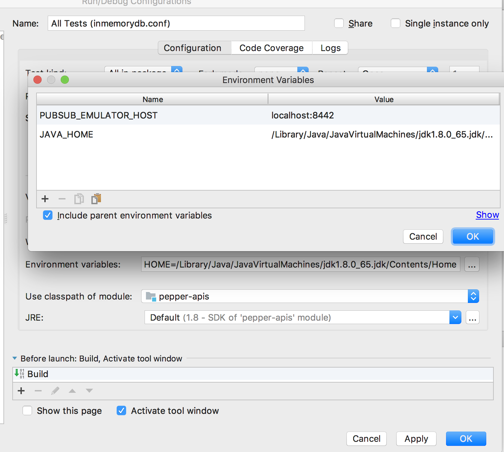
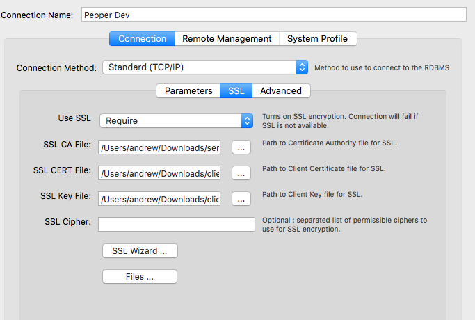

# Backend services for the Data Donation Platform

# REST APIs

## Java 11

This project uses Java 11, please see the [docs here](docs/java-11.md)
for more details on setting up Java 11.

## Running the platform locally (Linux)

Sections below describe different aspects of the platform. However, this section doesn't go deep into
internals, it's just a set of instructions for quickly making the platform up and running on a local machine.
If you need to learn more, read 'till the end of the file :)

For testing purposes, the platform can be run locally without involving Docker containers. Before you
go, please install and configure the dependencies first:

1. Maven - used for building the project
2. Ruby - used for rendering configuration files from templates
3. Docker
    * Install Docker using your package manager
    * Please note that Docker commands REQUIRE `sudo` under Linux by default
    * Under OSX, however, you MUST NOT use `sudo`
    * If you want to avoid using `sudo` or becoming root under Linux, add your user to the `docker` group:
        * `# usermod -aG docker <username>`
    * Make sure the Docker daemon is up and running. Start it, if that's not the case
        * `$ ps -edf | grep dockerd | grep -v grep`
    * Register a new account on [dockerhub](https://hub.docker.com), using your broad gmail
    * Email help@broad and ask them to link your dockerhub account to the `kduxengineering` dockerhub group
    * Log in to Docker using these credentials:
        * `$ docker login` (use `sudo` on linux, but not osx)
4. Gitub - a dependency for Vault. You must create a personal access token following [the instructions]
(https://broadinstitute.atlassian.net/wiki/spaces/DO/pages/113874856/Vault)
5. Vault - used for authentication
    *  [Download Vault client](https://www.vaultproject.io/downloads.html)
    * Unpack Vault and put its sole binary into a software directory (e.g., `/opt/vault`)
    * Update the PATH variable
        * `$ echo 'export PATH=/opt/vault/vault:$PATH' >> ~/.bashrc`
    * Set up the VAULT_ADDR environment variable
        * `$ echo "export VAULT_ADDR=https://clotho.broadinstitute.org:8200" >> ~/.bashrc`
    * Authenticate with Vault
        * `$ vault auth -method=github token=$(cat ~/.github-token)`
6. Google's [pubsub emulator](https://cloud.google.com/pubsub/docs/emulator).  We need this to run houskeeping locally and for
tests related to housekeeping.

```
gcloud components install beta --quiet
gcloud components install pubsub-emulator --quiet
gcloud components update --quiet
```

Now that all dependencies are installed:

1. Clone the DDP repository and step into it
    ```sh
    $ cd ~
    $ mkdir git && cd git
    $ git clone git@github.com:broadinstitute/ddp.git
    $ cd ddp/pepper-apis
    ```
2. Render the configuration file. IMPORTANT: sudo is necessary because the script executes Docker under the hood
    * `$ ./api-build.sh v1 dev . --config` (use `sudo` on linux but not osx)
3. Build the project
    * `$ mvn -DskipTests=true clean install`
    * `$ mvn -DskipTests -f parent-pom.xml install`
4. Run the JAR
    * `$ java [pile of -D vars copy-pasted from output-build-config/local-java-props.txt] -jar ./target/DataDonationPlatform.jar`
5. Make sure Jetty has started
    * `$ telnet localhost 5555`

Lastly, setup your local environment with [checkstyle](docs/setting-up-checkstyle.md)
to follow established coding conventions.

## api-build.sh  [version] [environment] [dir] [--mode]
The `api-build.sh` script helps automate a few different steps of the process for both
local development and in jenkins.  It has four key parameters:
* `version` is the version of the code, such as `v1`
* `environment` is the environment against which to build, one of
    * `dev`,`test`,`staging`, or `prod`
* `dir` is the local directory from whence `docker-compose` volumes originate.
    * use `.` for local builds; jenkins uses `/app`
* `mode` controls what the script does--in additive fashion--one of:
    * `--config`: renders config files by reading secrets from vaults and writing output to `output-config` and `output-build-config`
    * `--docker-build`: `config` plus builds backend container
    * `--test`: all of the above, plus runs the tests
    * `--docker-push`: all of the above, plus pushes the backend docker image (`broadinstitute/pepper-api-backend` tagged with `$VERSION_$ENV`) to dockerhub
    * `--nginx`: creates nginx docker image
    * `--jenkins` does everything (should only be used from jenkins)

### Options when building backend container
* `DEBUG` when set to `true`, will open up port 9786 and launch the backend with debugging enabled
* `NGINX_PROXIED_HOST` controls the IP that nginx will proxy to.  Use this to run nginx locally
via docker and have nginx proxy your non-dockered locally running instance of the backend.  Use
this in conjunction with `ifconfig` magic to reserve a fixed IP
address locally and have nginx proxy to your locally deployed java app.  For example:
```sh
$ sudo ifconfig lo0 alias 192.168.1.100/24
$ export NGINX_PROXIED_HOST=192.168.1.100
```

### Running tests and main apps (DataDonationPlatform.java and Housekeeping.java) in intellij and mvn
After running `api-build.sh` (you ran that already, right?), take a look at the `output-build-config/local-java-props.txt`
file.  This file contains a bunch of `-D` vars that you'll need to put into either your
intellij run/debug profiles or your command-line `mvn` command.

Before starting the tests or running the apps, you need to setup the coordinates for the pubsub emulator:
```
$ export PUBSUB_EMULATOR_HOST=localhost:8442
```

The you can run the tests:
```sh
$ mvn test [pile of -D vars copy-pasted from output-build-config/local-java-props.txt]
```





You may need to set `JAVA_HOME` as an environment variable in Intellij manually, depending on whether/how your machine sets up java by default.




### Testing API calls
In order to send a request to the service, you must obtain an `idToken` first
* Navigate to TestApp and log in using test user credentials
* Check the logs in the TestApp interface to see the JSON and get `idToken` contents
* It can be that a TestApp is down. In this case run Chrome, press F12 to enable Developer Tools and then:
    * Go to the Console tab and execute `localStorage.getItem('session_key')` or
    * Go to the Network tab and check the contents of the "Authorization" header
* Put the token to a file:
    * `$ echo "<token contents>" >> ~/token`
* Send a request using the token, for example:
    * `$ curl -H "Authorization: Bearer $(cat ~/token)" -v localhost:5555/pepper/v1/user/19i3-test-user-48f0/studies/TESTSTUDY1/activities`
* Check the response status, it shouldn't be 401 (you can get it if the token has expired or invalid)


## Databases
We track schema changes via liquibase, use hsqldb for local in-memory databases,
and google cloudsql/mysql for our CI dev/test/staging/prod environments. For connecting
to hsqldb locally, see [docs/hsqldb-on-cli.md](docs/hsqldb-on-cli.md).

### Setting up a local mysql database
Local mysql databases have some advantages over hsqldb:

1. They more closely resemble what you'll find in dev/test/staging/prod
2. You can connect to them with sql clients, which you can't do with our default disposable hsqldb

Beware that our cloudSQL databases require SSL, and if you don't enable SSL on your local mysql instance, you may
end up with surprises during CI builds. If you still want to disable SSL locally, append the following parameter to the
JDBC connection string (see the details on how to set it below):

`useSSL=false`

You'll need to download mysql for your local machine, make note of the generated password during installation,
create a separate schema in your database, and create a new user for the database.

1. [Download mysql](https://dev.mysql.com/downloads/mysql/) and note one-time share of root password

2. Read through the [install docs](https://dev.mysql.com/doc/refman/5.7/en/osx-installation-launchd.html)

3. Download a decent sql client, such as [mysql workbench](https://www.mysql.com/products/workbench)

4. Create a new local schema (the name is not important)
```
CREATE DATABASE pepperlocal CHARACTER SET utf8 COLLATE utf8_general_ci;
```

5. Create a new user and grant privileges to it (you can skip this step if you use `root` MySQL user).
Note that the `RELOAD` priviledge is needed for some unit tests.
```
CREATE USER '[your db user]'@'%' IDENTIFIED BY '[your db password]';
GRANT ALL ON pepperlocal.* TO '[your user]'@'%';
GRANT RELOAD on *.* TO '[your user]'@'%';
```

6. Add the following to the global MySQL configuration file (`/etc/mysql/my.cnf`):
```
[mysqld]
max_allowed_packet=32M
character-set-server = utf8
collation-server = utf8_unicode_ci
skip-character-set-client-handshake
```
Restart MySQL service after making changes (an Ubuntu Linux example):
```
$ service mysql restart
```

If you don't do that, MySQL won't handle Unicode strings properly (one of the manifestations are '???' symbols in the
MySQL CLI output of internationalized strings). Since we support multiple languages, this is a must.

7. Update the _rendered_ secrets file `*.conf` (**not** `*.conf.ctmpl`), for example `output-build-config/testing-inmemorydb.conf`.
```
...
"dbUrl":"jdbc:mysql://127.0.0.1:3306/pepperlocal?user=[your db user]&password=[your db password]&serverTimezone=[your time zone]"
...
```

Note that our `.gitignore` files will ignore your local changes to rendered secrets files.  This is
by design, so that we don't commit secrets to source code control.  If you re-render secrets between
builds, you will need to re-update your `*.conf` files with any local changes.

### Manually Connecting to CloudSQL (google's mysql)

Our cloud databases use SSL.  In order to connect, you must have the CA cert, the individual cert, and the key file.
Here's how to get them:

```
vault read -field=value secret/pepper/dev/v1/db-server-ca > cert.ca
vault read -field=value secret/pepper/dev/v1/db-client-cert > cert.crt
vault read -field=value secret/pepper/dev/v1/db-client-key > cert.key
```

Use these three files to configure MSQLWorkbench's connection like so:



Database coordinates are in the rendered `application.conf` file.

In addition to SSL and the username/password combination, you must also be on a Broad network in order to access the database or use VPN.

If you are using the MySQL CLI, connect using the password from the `pepper-apis/output-config/application.conf` and specifying certificates
(info on how to obtain them is given in the "Connecting to CloudSQL (google's mysql)" section above):

```
$ mysql -h [dev mysql server] -u[username] -p[password] --ssl-ca [path to cert.ca] --ssl-cert [path to cert.crt] --ssl-key [path to cert.key]
```

Alternatively, you can get credentials by reading the "dbUrl" property from Vault:

```
$ vault read -field dbUrl secret/pepper/dev/v1/conf
```

### CloudSQL Proxy

`DDP -> cloudsqlproxy -> cloudsql`

To avoid the complexity of keystore maintenance, we use google's [cloudsql proxy](https://cloud.google.com/sql/docs/mysql/sql-proxy).

This means that in order for the app to connect to one of our cloud databases, you must install **and run** the proxy
on your machine whenever you want DDP to connect to a cloud database.

The proxy introduces a level of indirection, so make sure you know **what the proxy is pointing at _before_** you connect your client.  Because your client will connect to something like `127.0.0.1:3306`, you can't tell from your client what database you're actually
connecting to.

**Please always check where the proxy is pointing to so that you don't connect to the wrong database**.

After installing the proxy, you can run it by passing in the value of the `CLOUDSQL_CONNECTION_LIST` variable in the rendered
[output-config/sqlproxy.env](output-config/sqlproxy.env) file, along with the path to the rendered service account like so:

```
./cloud_sql_proxy -instances=[value of CLOUDSQL_CONNECTION_LIST var]
-credential_file=[path-to-your-pepper]/output-config/sqlproxy-service-account.json
```

### Importing the `dev` MySQL database into your environment:

Sometimes it's necessary to use the `dev` data in your local environment (e.g. for reproducing an issue found in `dev`). In order
to do that, one should import the `dev` database dump:

1. Create the dump:

```
$ mysqldump -h [dev mysql server] -u[username] -p[password] --ssl-ca [path to cert.ca] --ssl-cert [path to cert.crt] --ssl-key [path to cert.key] --extended-insert=false pepperdev > [path to sql file]
```

2. Re-create your local database in the MySQL CLI:

```
mysql> drop database ddp;
mysql> create database ddp;
```

3. Import the dump into your local database:

```
mysql> use ddp;
mysql> source /path/to/dump.sql;
```

## Security
We take security very seriously.  We use Auth0 and JWTs to help manage authn and
authz.  It is up to us as developers to ensure that every route is properly protected.

### SQL
We keep our sql statements in `src/main/resources/sql.conf`.  Portability of
SQL is very important, as we test locally against hsqldb or mysql, but deploy to CI
 and production using cloudSQL/mysql.

### Global and Test-Specific Changelogs
At startup time, the "global" changelogs are run.  Global changelogs are those
changelogs that apply to all environments--dev, test, qa, prod, etc.  Sometimes, however,
you want to mess with the database in specific ways for specific tests, outside
of production.  Changelogs that are test-specific are stored in `test/resources/db-testscripts`
and are run on-demand _only by the test cases that need them_.  These changlogs are applied
in the test environment _after_ the global changelogs are applied.


## Testing Deployed Routes
To run tests against deployed instances, you have two options: either spin up
a server as part of your test by extending `TestStartupUtil` or point your
test at a previously-deployed instance.

`TestStartupUtil` is a utility that will boot a server in a separate process
exactly once during any kind of test run.  Use this utility for rapid local
iteration.  To enable it, set `-Dddp.testing.bootAppLocally=true`.  Without this flag,
the app will not be booted.  By leaving the flag off, you can run the same
tests against a different deployment, thereby keeping the tests the same 100% the same
 (including liquibase) but pointing them at a different server instance.


## What's with the gigantic `IntegrationTests` class?
It's enormous so that we only boot the appserver once for all integration tests, which
means that execution time for integration tests should be much quicker.  This might need to
be revisited when we start to bring in DI tools like guice and mocks.

## Testing is an activity orthogonal to the environment
One can test things locally, in the dev environment, and in the test environment.
There are _testing_ configuration files that instruct the tests how to operate
in a way that is compatible with the environment.

## Editing `/etc/hosts`
You may find it useful to connect to a local build, using the full docker deployment,
including nginx certs.  To do this in such a way that you don't run afoul of SSL validation,
you'll want to edit your `/etc/hosts` file like so:
```
sudo emacs /etc/hosts
...point pepper-dev.datadonationplatform.org at 127.0.0.1...
sudo killall -HUP mDNSResponder
```


## Auth0 Integration, Rules, Authn, and Authz
We use auth0 for identity management.  We augment auth0's JWT id token during login
via rules that run inside of auth0.  The source for the rules [is here](rules).

While we use auth0 for authentication (authn), we use in-app authorization (authz)
instead of adding extensive authz claims to our JWTs.  We do this primarily because
we want up-to-date ACL data without the hassle of re-issuing JWTs when ACLs change.

When a user logs in, just before a JWT is returned to the client, the auth0 rules fire
and connect to a deployed instance of pepper to register the user (if they haven't
signed up already) and add the pepper user guid to the JWT.  Due to firewall
restrictions, sometimes we need to mock the connectivity between auth0 and pepper.
This mocking is controlled by client metadata in auth0.  The `mockRegistration` value
(boolean) controls whether or not the rule will use mock data or connect to a real
pepper endpoint.  If set to `true`, the `overrideUserGuid` value (String) will be
added to the JWT.  By changing the client metadata, you can change what gets
added to the JWT without requiring a live connection between auth0 and a deployed
instance of pepper.

# Housekeeping
TBD...
