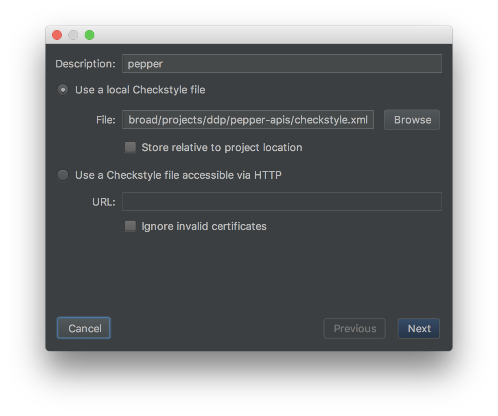

# Checkstyle

Having established coding conventions is important for consistency,
especially when there are many developers working on the code. We use
[checkstyle][cs] for this purpose, and it plugs into the build process with
[maven][mvn-plugin].

[cs]: http://checkstyle.sourceforge.net/
[mvn-plugin]: https://maven.apache.org/plugins/maven-checkstyle-plugin/index.html

## Getting Started

Checkystyle is already configured as part of the project. Every build via
maven should trigger the checkstyle linting process, and fails the build if
there are codestyle violations. Note that checkstyle linting is done even
before tests are ran.

The build should output the style violations, but to generate the checkstyle
report for inspection, run this:

```bash
$ mvn checkstyle:checkstyle
```

Then open `./target/site/checkstyle.html` in your browser. You can also generate
the checkstyle report along with other neat reports about the project by
running this:

```bash
$ mvn site
```

Then open `./target/site/index.html` in you're browser. The checkstyle report
is under "Project Reports" on the left menu panel.

## IDE Support

There are IDE plugins that check your code according to the style rules, and
possibly fixing them too.

### Intellij

First, install and configure the checkstyle plugin:

1. Open `Preferences > Plugins > Browse repositories`.
2. Search for `checkstyle`.
3. Install the `CheckStyle-IDEA` plugin and restart Intellij.
4. Open `Preferences > Other Settings > Checkstyle`.
5. Select version `8.8` and use scan scope `All sources (including tests)`.
6. Under `Configuration File` table, click `Add` button.
7. Then choose our local `checkstyle.xml` file, `Next`, and `Finish`.
8. Check `Active` on the file we just imported and save.




You should now have a tab at the bottom left of your IDE where you can pull
the checkstyle plugin and run lints on the project files.

Second, import checkstyle settings to editor:

1. Open `Preferences > Editor > Code Style`.
2. Select the `Project` scheme.
3. Click the gear button, then `Import Scheme > CheckStyle Configuration`.
4. Select the local `checkstyle.xml` file.
5. The import might not pull in everything, so go over the settings and make
   any necessary changes to fit the code style.
6. Click `OK`.

You can now use editor commands to help format the code, like `Code >
Optimize Imports` and `Code > Reformat Code`.

### VS Code

There is an [extension][vsc-extension] available, but it has not been
evaluated yet.

[vsc-extension]: https://marketplace.visualstudio.com/items?itemName=shengchen.vscode-checkstyle

## Skipping Checks

You may want to run the maven build without doing the checkstyle linting. This
can be done by setting the `skip` flag to `true`, for example:

```bash
$ mvn -Dcheckstyle.skip=true clean package
```
